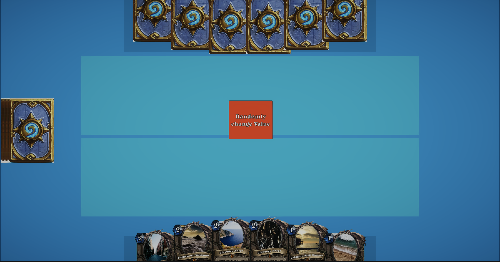

# TestForRedRift

A Test card game for Red Rift.

## Overview

### Cards Info is created with Scriptable objects. It can be found in Resources/Scriptable Objects/Cards
Card Info consist of 
- Card Name 
- Card Description 
- Mana cost 
- Attack 
- Health 

### In hierarchy in the Deck gameobject the Deck Setup script can be found. 
This script will take all scriptable objects from resources files and load it, also initializes deck on game start.
### Card Deal Script
Will deal all cards to player hand in rotation with using Dotween, deal amount determined randomly between 4-6 cards.
### Card
- Can be hovered, to see them.
- Can be dragged to Drag zone 
- Card has stats
- On Card drag green outline will be seen

- If cards dropped not on drag zone, return back to hand
- Card image downloaded randomly on game start. Image download script can be found on Card with name Image

#### Assets used
- Dotween
- UI Extensions

### Change Button
- Button changes cards values in drag zone randomly between -2 to 9
- If Card health < 0, card will be destroyed
## Software

This project was created using Unity 2021.2.5f1 and Universal Render Pipeline 12.1.2.

Any other techniques not used because of asked simplicity of project